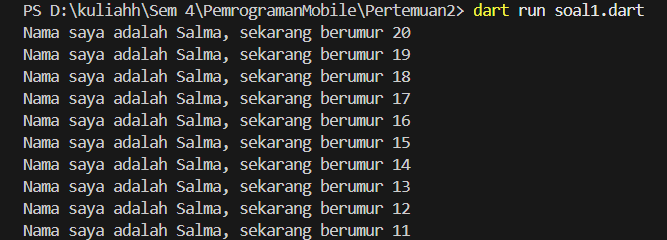
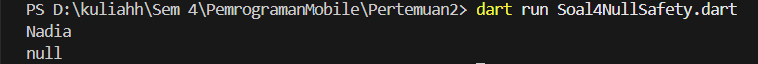
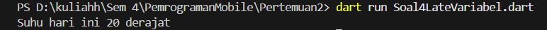

# Praktikum 02 Pengantar Bahasa Pemrograman Dart - Bagian 1

Nama    : Nadia Minatul Salma <br>
NIM     : 244107060141 <br>
Absen   : 11 <br>

---

## Soal 1

Modifikasilah kode pada baris 3 agar mendapatkan output sesuai yang diminta.

Kode Awal

```dart
void main() {
  for (int i = 0; i < 10; i++) {
    print('hello ${i + 2}');
  }
}
```
Output :


## Soal 2
Mengapa sangat penting untuk memahami bahasa pemrograman Dart sebelum kita menggunakan framework Flutter ? Jelaskan!
Jawaban :
Bahasa pemrograman Dart merupakan dasar utama dalam framework Flutter. Semua struktur aplikasi seperti widget, state, navigasi, serta logika program ditulis menggunakan Dart. Oleh karena itu, memahami Dart sangat penting karena:
- Flutter sepenuhnya menggunakan bahasa Dart
- Konsep OOP (class, object, function) digunakan dalam pembuatan widget
- Pengelolaan state dan logika aplikasi bergantung pada sintaks Dart
- Mempermudah debugging ketika terjadi error
Dengan memahami Dart terlebih dahulu, proses belajar Flutter akan lebih mudah dan terstruktur.

## Soal 3
Rangkumlah materi dari codelab ini menjadi poin-poin penting yang dapat Anda gunakan untuk membantu proses pengembangan aplikasi mobile menggunakan framework Flutter.
Jawaban :
Beberapa poin penting yang dipelajari:
- Flutter menggunakan bahasa pemrograman Dart
- Fungsi main() adalah titik awal program
- Semua tampilan di Flutter adalah Widget
- Terdapat dua jenis widget: StatelessWidget dan StatefulWidget
- Layout disusun menggunakan Row, Column, dan Container
- Scaffold digunakan sebagai kerangka dasar tampilan
- setState() digunakan untuk memperbarui tampilan pada StatefulWidget
- Flutter memiliki fitur Hot Reload untuk mempercepat proses pengembangan
- Null Safety mencegah error akibat nilai null

## Soal 4
Buatlah penjelasan dan contoh eksekusi kode tentang perbedaan Null Safety dan Late variabel !
Jawaban :
Null Safety
Contoh :
```dart
void main() {
  String nama = "Nadia";
  String? panggilan;

  print(nama);
  print(panggilan);
}
```
Output :

Penjelasan :
Variabel nama tidak boleh null karena tidak menggunakan tanda ?.
Sedangkan panggilan boleh bernilai null karena menggunakan String?.
Late Variable
Contoh :
```dart
late int suhu;

void main() {
  suhu = 30;
  print("Suhu hari ini $suhu derajat");
}
```
Output :
