# Praktikum 03 Pengantar Bahasa Pemrograman Dart - Bagian 2

Nama    : Nadia Minatul Salma <br>
NIM     : 244107060141 <br>
Absen   : 11 <br>

---

# Praktikum 1: Menerapkan Control Flows ("if/else")

## Langkah 1

### Soal
Ketik atau salin kode program berikut ke dalam fungsi `main()`.

```dart
String test = "test2";
if (test == "test1") {
   print("Test1");
} else If (test == "test2") {
   print("Test2");
} Else {
   print("Something else");
}

if (test == "test2") print("Test2 again");
```

### Output
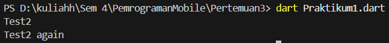

---

## Langkah 2

### Soal
Silakan coba eksekusi (Run) kode pada langkah 1 tersebut. Apa yang terjadi? Jelaskan!

### Jawaban

Saat kode dijalankan akan muncul **error**.  
Hal ini terjadi karena penulisan keyword pada Dart **bersifat case sensitive**.

Kesalahan pada kode tersebut adalah:

- `If` seharusnya ditulis **if**
- `Else` seharusnya ditulis **else**

Karena Dart hanya mengenali keyword dengan **huruf kecil semua**, maka program tidak dapat dijalankan sebelum diperbaiki.

---

## Langkah 3

### Soal
Tambahkan kode program berikut, lalu coba eksekusi (Run) kode Anda.

```dart
String test = "true";
if (test) {
   print("Kebenaran");
}
```

### Output
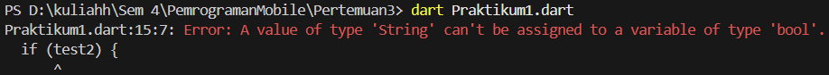

### Jawaban

Kode tersebut menghasilkan **error** karena kondisi pada `if` harus berupa **boolean** (`true` atau `false`).  

Variabel `test` bertipe **String**, sehingga tidak dapat langsung digunakan sebagai kondisi.

---

### Perbaikan Kode

Kode diperbaiki dengan melakukan **perbandingan nilai string**.

```dart
void main() {
  String test = "true";

  if (test == "true") {
    print("Kebenaran");
  } else {
    print("Bukan kebenaran");
  }
}
```

### Output
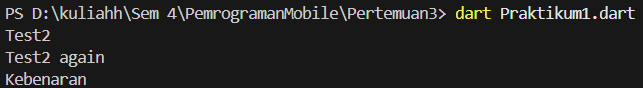

---

# Praktikum 2: Menerapkan Perulangan "while" dan "do-while"

## Langkah 1

### Soal
Ketik atau salin kode program berikut ke dalam fungsi `main()`.

```dart
while (counter < 33) {
  print(counter);
  counter++;
}
```

### Output
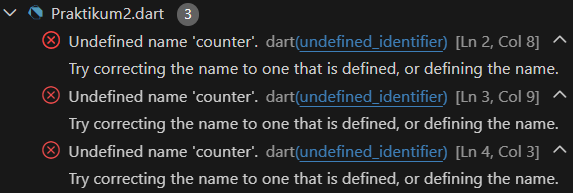

---

## Langkah 2

### Soal
Silakan coba eksekusi (Run) kode pada langkah 1 tersebut. Apa yang terjadi? Jelaskan!

### Output
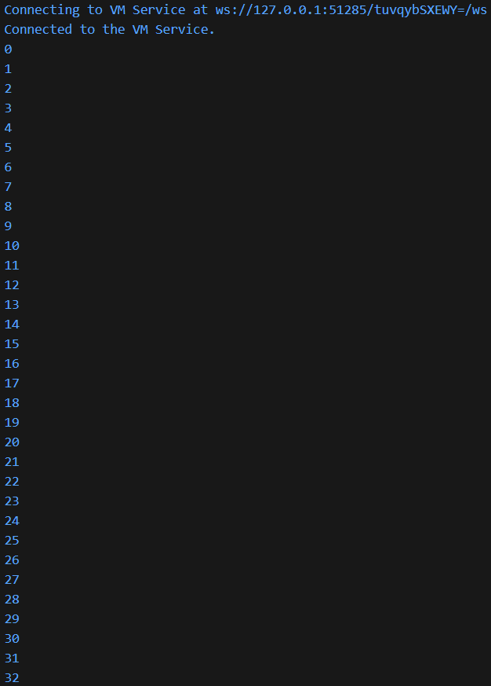

### Jawaban

Ketika program dijalankan akan muncul **error** karena variabel `counter` belum dideklarasikan.

Dalam Dart, setiap variabel harus **dideklarasikan terlebih dahulu sebelum digunakan**.

Perbaikannya dengan menambahkan deklarasi variabel.

```dart
void main() {
  int counter = 0;

  while (counter < 33) {
    print(counter);
    counter++;
  }
}
```

Program akan menampilkan angka dari **0 sampai 32**.

---

## Langkah 3

### Soal
Tambahkan kode program berikut, lalu coba eksekusi (Run) kode Anda.

```dart
do {
  print(counter);
  counter++;
} while (counter < 77);
```

### Output
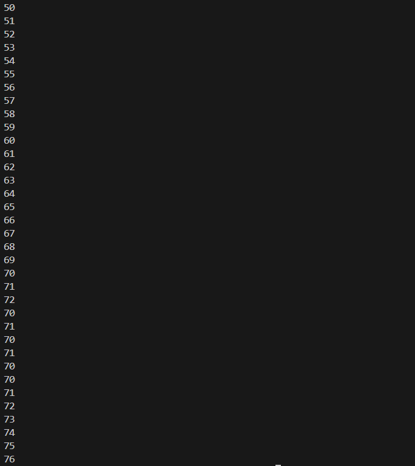

### Jawaban

Perulangan **do-while** akan menjalankan kode **minimal satu kali terlebih dahulu**, kemudian baru mengecek kondisi.

Pada program ini angka akan ditampilkan mulai dari **33 sampai 76**.

---

# Praktikum 3: Menerapkan Perulangan "for" dan "break-continue"

## Langkah 1

### Soal
Ketik atau salin kode program berikut ke dalam fungsi `main()`.

```dart
for (Index = 10; index < 27; index) {
  print(Index);
}
```

### Output
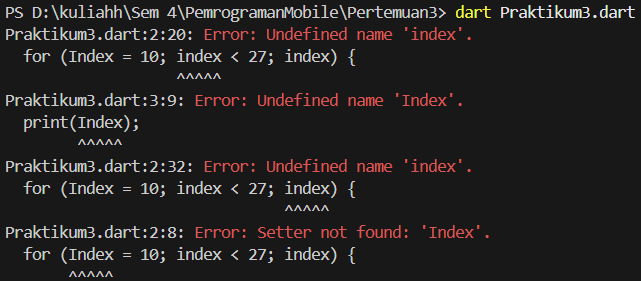

---

## Langkah 2

### Soal
Silakan coba eksekusi (Run) kode pada langkah 1 tersebut. Apa yang terjadi? Jelaskan!

### Output
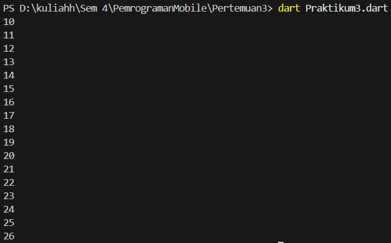

### Jawaban

Kode tersebut menghasilkan beberapa error karena:

1. Variabel `Index` belum dideklarasikan.
2. Penulisan `Index` dan `index` tidak konsisten.
3. Tidak ada increment `index++`.

Perbaikan kode:

```dart
void main() {
  for (int index = 10; index < 27; index++) {
    print(index);
  }
}
```

---

## Langkah 3

### Soal
Tambahkan kode program berikut di dalam for-loop.

```dart
If (Index == 21) break;
Else If (index > 1 || index < 7) continue;
print(index);
```

### Output
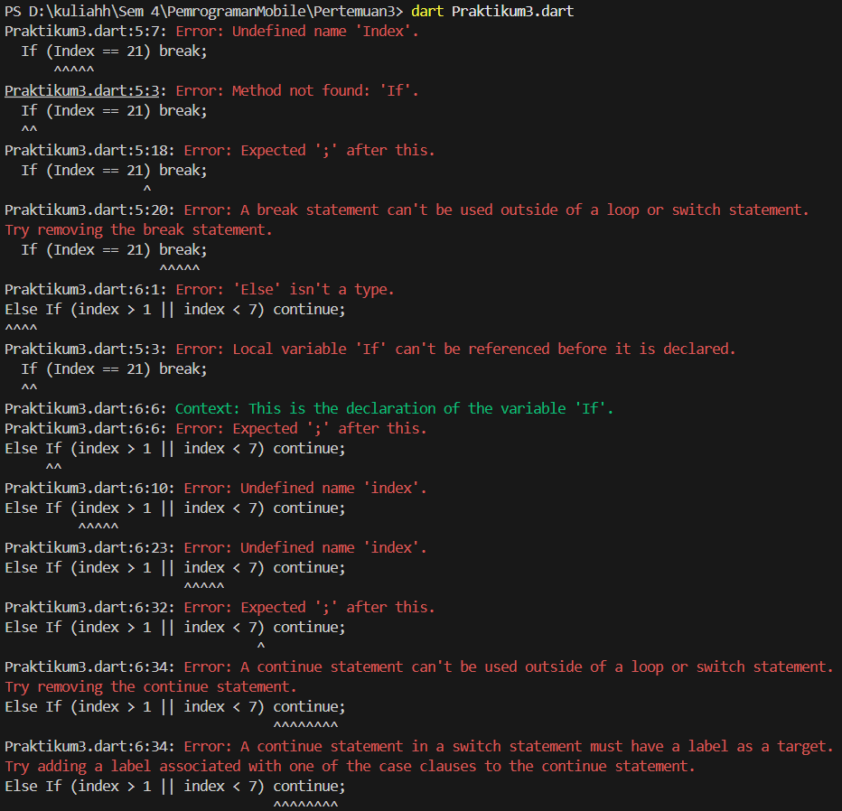

Kode tersebut masih menghasilkan error karena:

- Penulisan `If` dan `Else If` tidak sesuai dengan syntax Dart.
- Penulisan variabel `Index` tidak konsisten.

---

### Perbaikan Kode

```dart
void main() {
  for (int index = 10; index < 27; index++) {

    if (index == 21) {
      break;
    } else if (index > 1 && index < 7) {
      continue;
    }

    print(index);
  }
}
```

### Output
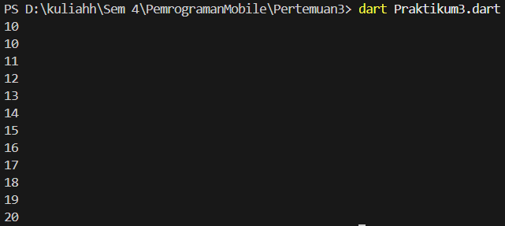

Program akan menampilkan angka dari **10 sampai 20**, kemudian berhenti ketika `index == 21`.

---

# Tugas Praktikum

### Soal

Buatlah sebuah program yang dapat menampilkan **bilangan prima dari angka 0 sampai 201** menggunakan Dart.  
Ketika bilangan prima ditemukan, maka tampilkan **nama lengkap dan NIM Anda**.

---

## Kode Program

```dart
void main() {
  String nama = "Nadia Minatul Salma";
  String nim = "244107060141";

  for (int i = 2; i <= 201; i++) {

    bool prima = true;

    for (int j = 2; j < i; j++) {
      if (i % j == 0) {
        prima = false;
        break;
      }
    }

    if (prima) {
      print("$i adalah bilangan prima - $nama ($nim)");
    }
  }
}
```

---

## Output

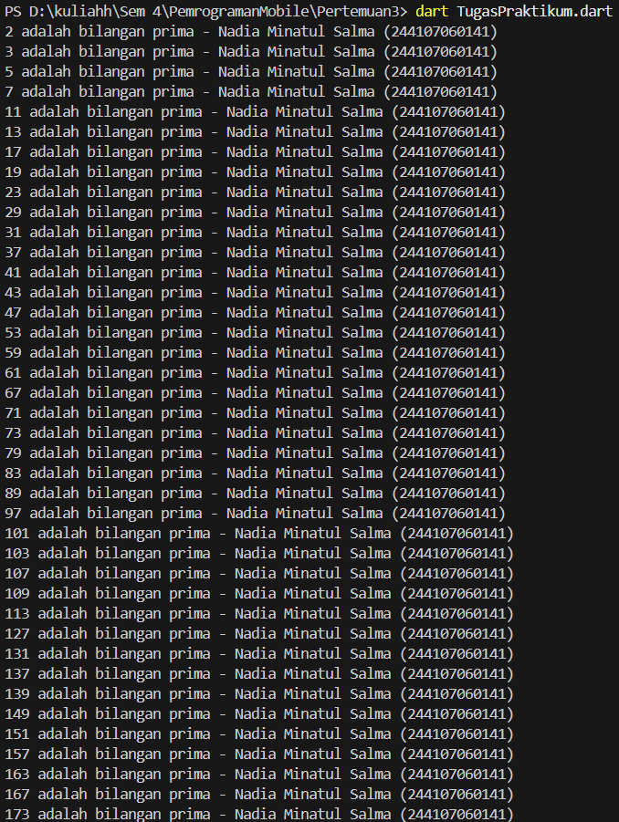

Program akan menampilkan semua **bilangan prima dari 2 sampai 201**, dan setiap bilangan prima akan disertai **nama lengkap dan NIM**.