# Praktikum 04 Pengantar Bahasa Pemrograman Dart - Bagian 3

Nama    : Nadia Minatul Salma  
NIM     : 244107060141  
Absen   : 12  

---

# Praktikum 1: List

## Langkah 1

### Soal
Ketik atau salin kode program berikut ke dalam fungsi `main()`.

### Kode Program
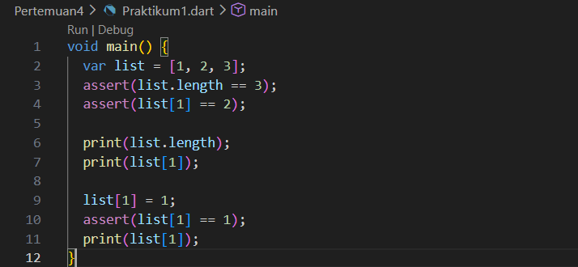

### Output
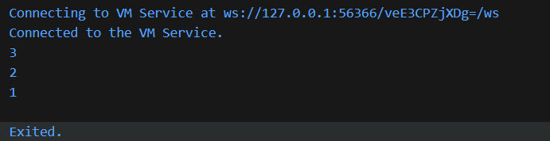

### Jawaban

Pada kode tersebut dibuat sebuah **List dengan panjang 5** menggunakan fungsi `List.filled()`.  
List tersebut awalnya berisi nilai `null`, kemudian elemen pada index tertentu diisi dengan **nama dan NIM**.

Ketika program dijalankan, maka list akan menampilkan isi berupa nama, NIM, dan beberapa nilai `null` pada index yang belum diisi.

---

# Praktikum 2: Sets

## Langkah 1

### Soal
Ketik atau salin kode program berikut.

### Kode Program
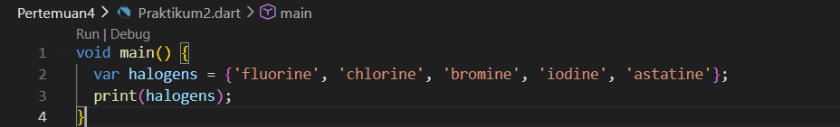

### Output
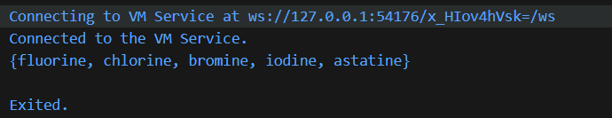

### Jawaban

Pada kode tersebut dibuat beberapa variabel yang berkaitan dengan **Set di Dart**.

- `names1` merupakan Set dengan tipe data `String`
- `names2` juga merupakan Set dengan tipe `String`
- `names3` sebenarnya bukan Set, tetapi dianggap sebagai **Map**

Ketika program dijalankan dapat muncul peringatan seperti berikut:

Peringatan tersebut berarti variabel `names3` dibuat tetapi **tidak digunakan dalam program**.

---

# Praktikum 3: Maps

## Langkah 1

### Kode Program
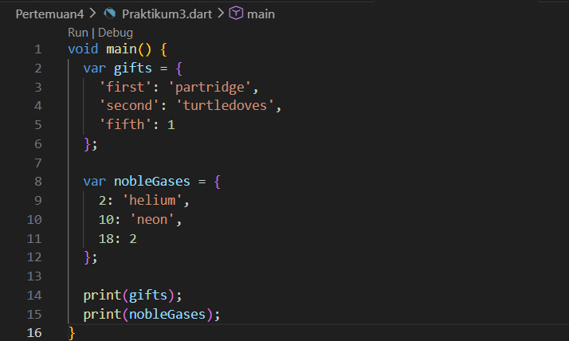

### Output
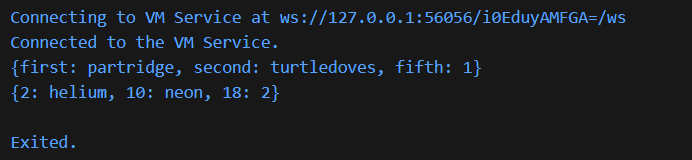

### Jawaban

Pada kode tersebut dibuat sebuah **Map** yang berisi pasangan **key dan value**.

Contohnya:

- `gifts` menggunakan key bertipe **String**
- `nobleGases` menggunakan key bertipe **Integer**

Map digunakan untuk menyimpan data dengan konsep **pasangan kunci dan nilai**.

---

## Langkah 3

### Kode Program
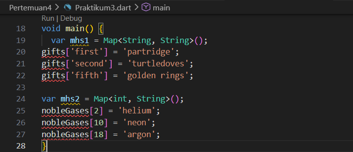

### Output
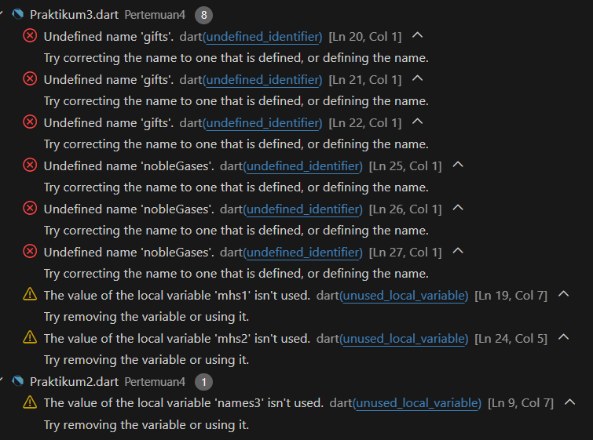

### Jawaban

Pada langkah ini ditambahkan beberapa data baru ke dalam **Map**.

Penambahan dilakukan dengan cara memberikan **key baru** pada Map.  
Jika key belum ada sebelumnya, maka data baru akan ditambahkan ke dalam Map tersebut.

---

# Praktikum 4: Records

## Langkah 1

### Kode Program
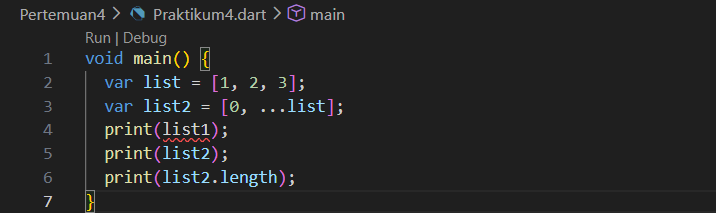

### Output
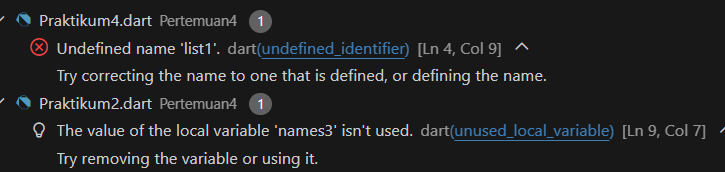

### Jawaban

Ketika kode dijalankan terjadi **error** karena terdapat kesalahan penulisan syntax.  
Kesalahan tersebut terjadi karena perintah `print(record)` tidak diakhiri dengan tanda `;`.

---

### Perbaikan Kode

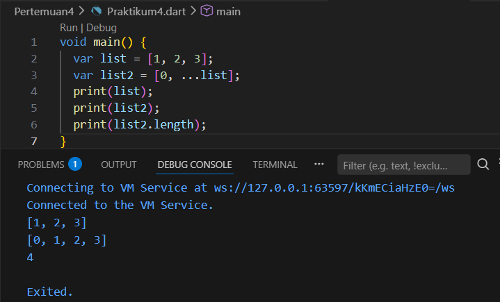

Setelah syntax diperbaiki, program dapat dijalankan dan akan menampilkan isi **Record** yang telah dibuat.

---

## Langkah 4

### Output Error
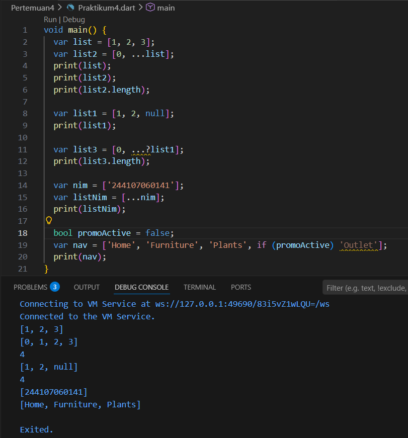

### Jawaban

Pada langkah ini terjadi error karena variabel `mahasiswa` hanya **dideklarasikan tetapi belum diberikan nilai**.

Dalam bahasa Dart, variabel harus **diinisialisasi terlebih dahulu sebelum digunakan**.

---

### Perbaikan

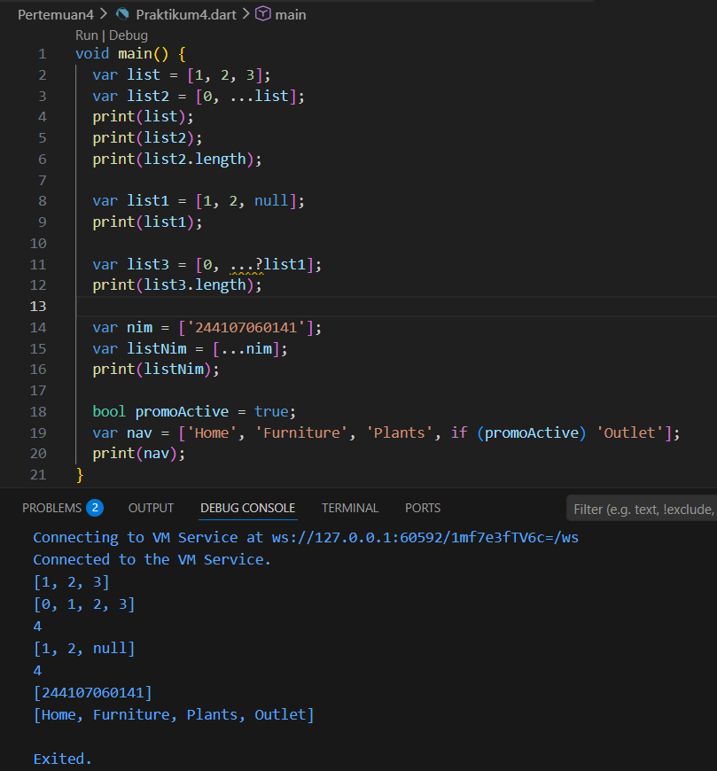

Setelah variabel diisi dengan **nama dan NIM**, program dapat dijalankan dengan baik dan menampilkan isi record tersebut.

---

## Langkah 5

### Output
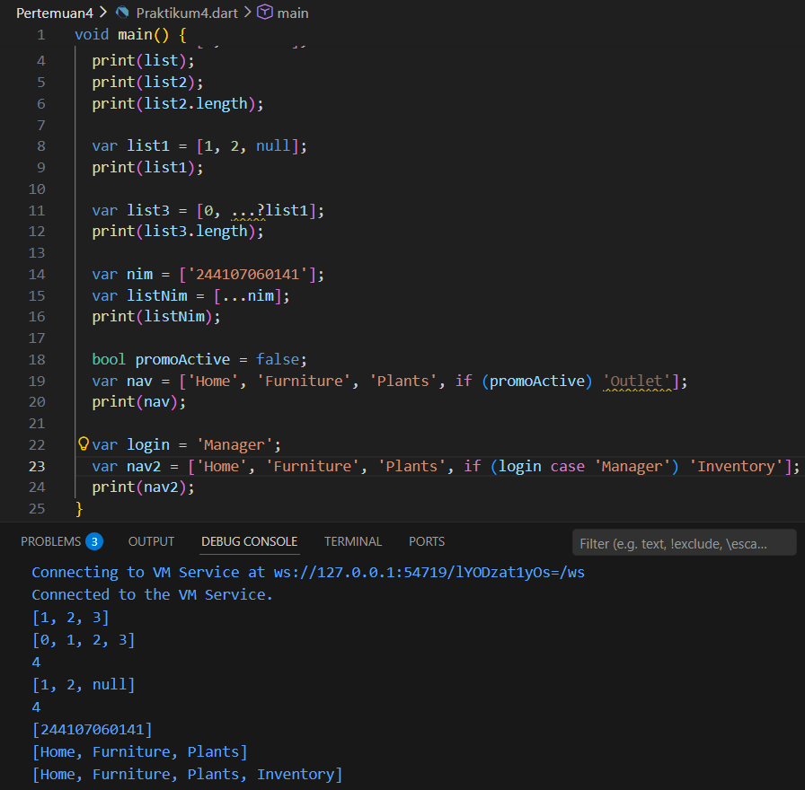

### Jawaban

Pada langkah ini dilakukan pengaksesan nilai dari **Record** menggunakan beberapa cara, yaitu:

- `$1` untuk mengambil elemen pertama
- `$2` untuk mengambil elemen kedua
- `a` untuk field dengan nama `a`
- `b` untuk field dengan nama `b`

Record memungkinkan penyimpanan beberapa nilai dengan tipe data yang berbeda dalam satu variabel.

---

# Praktikum 5: Functions

## Langkah 1

### Kode Program
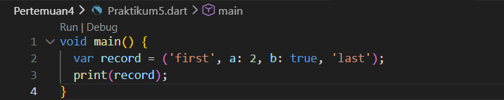

### Output
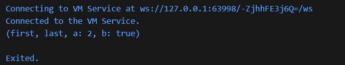

### Jawaban

Pada langkah ini dibuat sebuah **function sederhana** di Dart.  
Function merupakan blok kode yang digunakan untuk menjalankan suatu tugas tertentu dan dapat dipanggil kembali ketika diperlukan.

---

## Langkah 3

### Kode Program
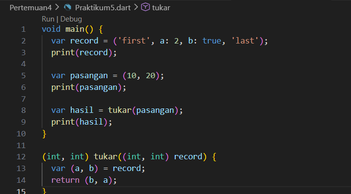

### Output
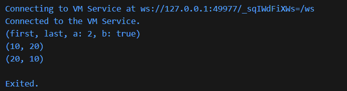

### Jawaban

Pada langkah ini function menggunakan **parameter** sehingga dapat menerima nilai dari luar function.  
Parameter memungkinkan function menjadi lebih fleksibel karena dapat digunakan dengan berbagai nilai yang berbeda.

---

## Langkah 5

### Output
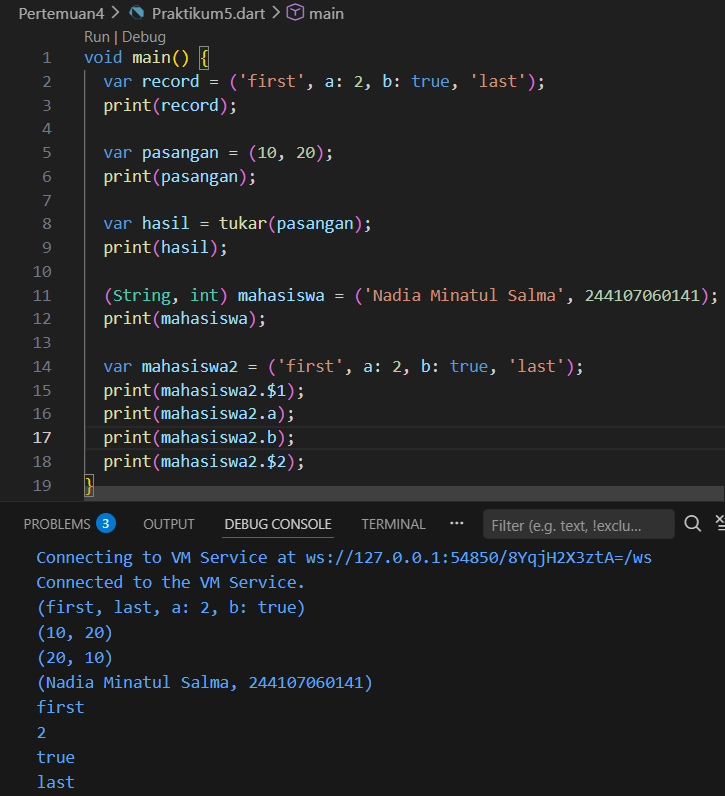

### Jawaban

Pada langkah ini ditunjukkan penggunaan function dengan beberapa jenis parameter yang berbeda.  
Hal ini menunjukkan bahwa dalam Dart function dapat dibuat dengan berbagai variasi parameter.

---

# Tugas Praktikum

## Nomor 1

Menyelesaikan seluruh praktikum dari **Praktikum 1 sampai Praktikum 5** dan mendokumentasikan hasilnya dalam bentuk screenshot kode program serta output yang dihasilkan.

---

## Nomor 2

### Pengertian Functions dalam Dart

Function adalah **blok kode yang digunakan untuk menjalankan suatu tugas tertentu** dan dapat dipanggil kembali ketika dibutuhkan.  
Dengan menggunakan function, program menjadi lebih terstruktur, mudah dibaca, dan tidak perlu menuliskan kode yang sama berulang kali.

---

## Nomor 3

### Jenis-jenis Parameter pada Functions

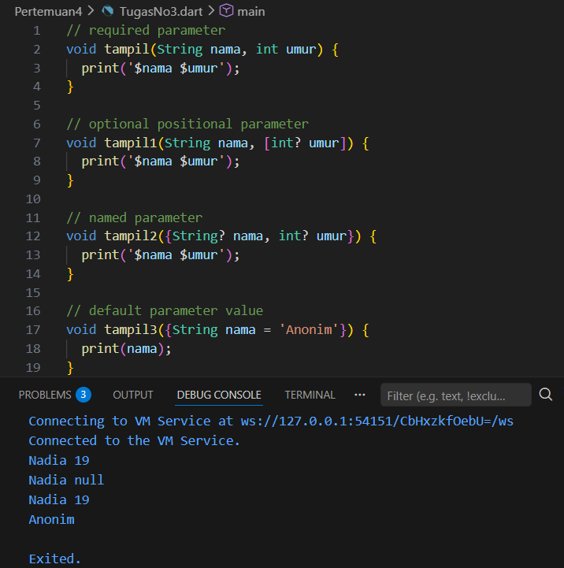

Pada Dart terdapat beberapa jenis parameter pada function, yaitu:

1. **Required Parameter**

Parameter yang wajib diisi ketika function dipanggil.

2. **Optional Positional Parameter**

Parameter yang bersifat opsional dan ditulis menggunakan tanda `[]`.

3. **Named Parameter**

Parameter yang dipanggil menggunakan nama parameter tersebut.

4. **Default Parameter**

Parameter yang memiliki nilai default apabila tidak diisi.

---

## Nomor 4

### Functions sebagai First-Class Objects

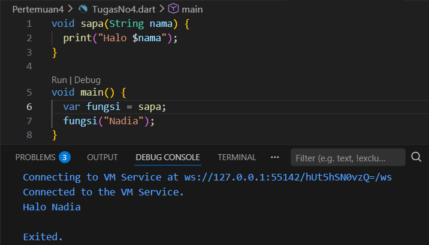

Dalam Dart, function dapat diperlakukan sebagai **first-class objects**.  
Artinya function dapat disimpan dalam variabel, dikirim sebagai parameter ke function lain, atau dikembalikan sebagai nilai dari sebuah function.

---

## Nomor 5

### Anonymous Functions

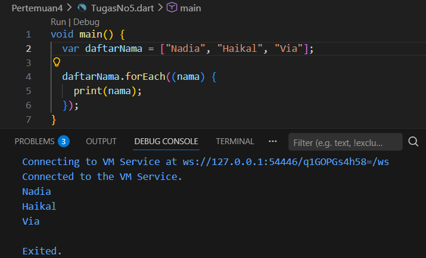

Anonymous Function adalah **function yang tidak memiliki nama**.  
Function ini biasanya digunakan secara langsung sebagai nilai dari sebuah variabel atau sebagai parameter pada function lain.

---

## Nomor 6

### Lexical Scope dan Lexical Closures

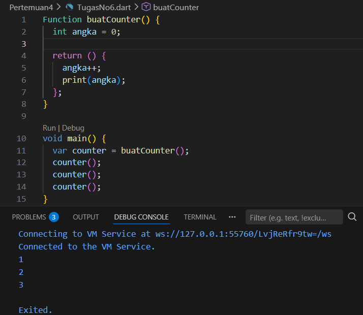

**Lexical Scope** adalah aturan yang menentukan bahwa sebuah variabel hanya dapat diakses dalam lingkup tempat variabel tersebut dideklarasikan.

**Lexical Closure** terjadi ketika sebuah function dapat mengakses variabel dari lingkup luar meskipun function tersebut dijalankan di tempat yang berbeda.

---

## Nomor 7

### Return Multiple Value pada Function

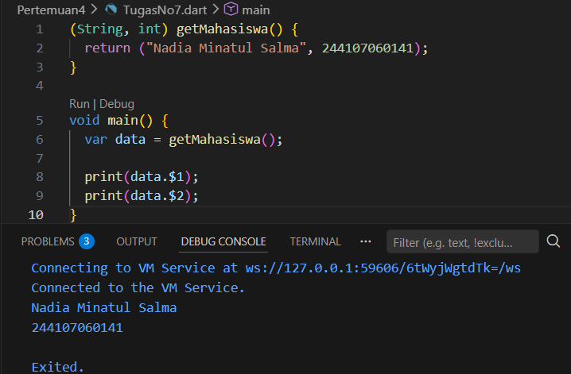

Dalam Dart, sebuah function dapat mengembalikan lebih dari satu nilai menggunakan **Record**.  
Dengan menggunakan record, beberapa nilai dapat dikembalikan sekaligus dalam satu return statement.