#  Praktikum 05 – First App & Widget Dasar Flutter

Nama : Nadia Minatul Salma  
NIM : 244107060141  
Absen : 12  

---

---

## 🔹 Praktikum 1 – Menjalankan Project Flutter

### Langkah 1

**Code:**
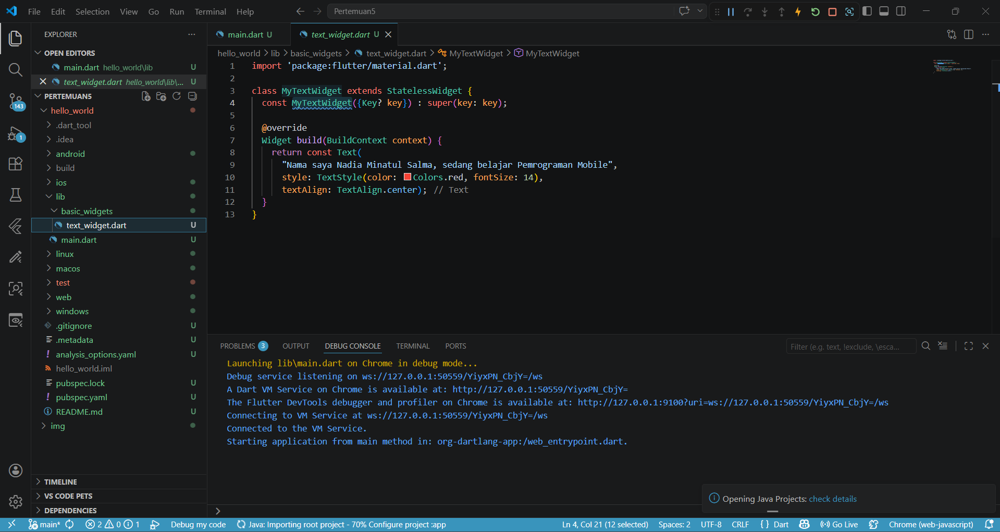

**Output:**
.png)

**Penjelasan:**
Project Flutter berhasil dijalankan menggunakan perintah `flutter run`. Tampilan awal masih berupa tampilan default dari Flutter.

---

## 🔹 Praktikum 2 – Menghubungkan ke Device

### Langkah 1
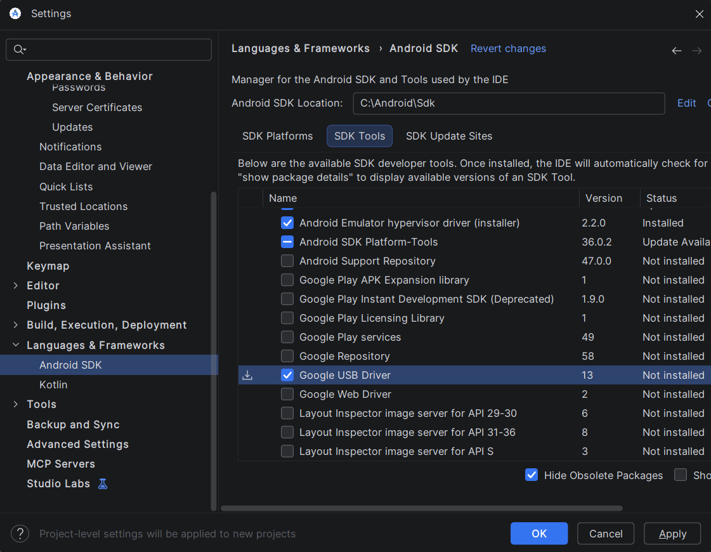

### Langkah 2
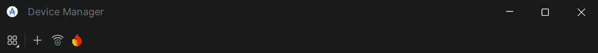

### Langkah 3
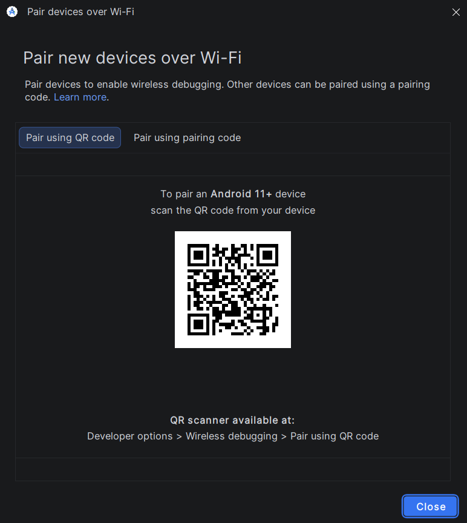

**Penjelasan:**
Pada tahap ini dilakukan proses koneksi aplikasi ke perangkat fisik (Android). Aplikasi berhasil dijalankan di device sehingga memastikan environment Flutter sudah berjalan dengan baik.

---

## 🔹 Praktikum 3 – Basic Widgets

### Langkah 1
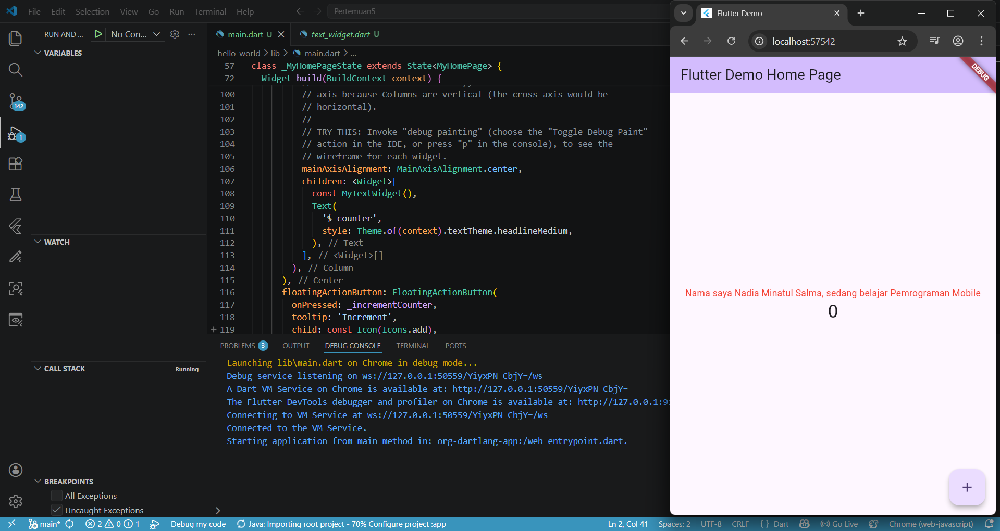

### Langkah 2
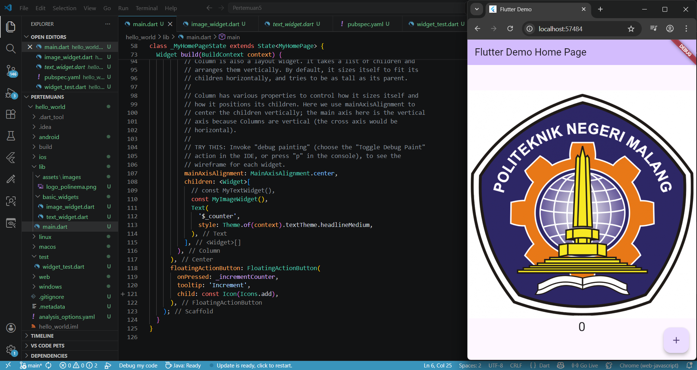

### Langkah 3
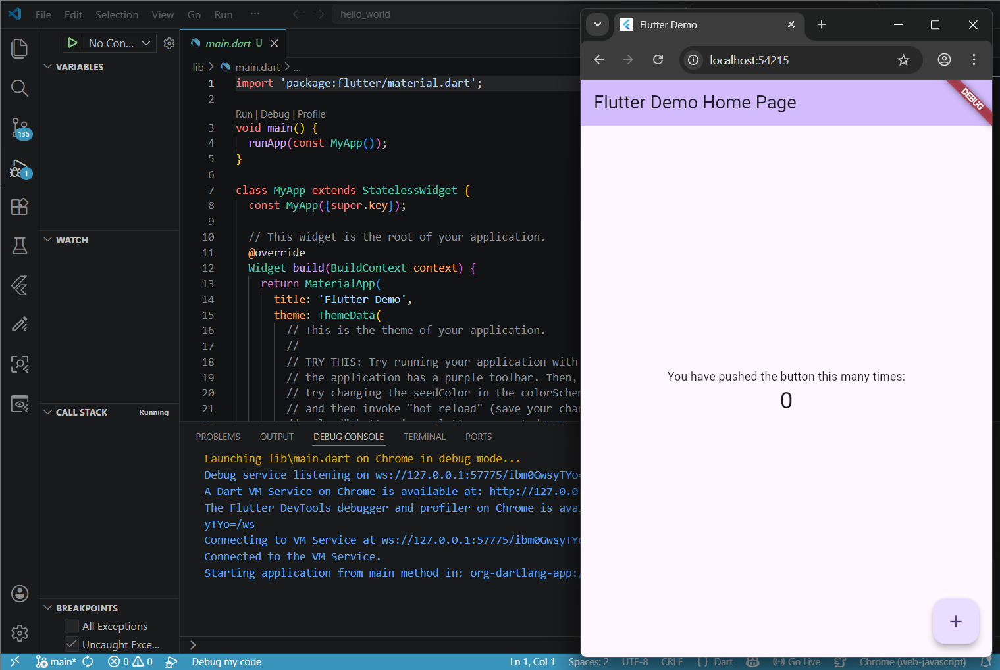

**Penjelasan:**
Pada praktikum ini mempelajari widget dasar Flutter seperti Text dan Image. Widget dibuat dalam file terpisah di folder `basic_widgets` kemudian di-import ke `main.dart`.

---

## 🔹 Praktikum 4 – Layout dan Widget Lanjutan

### Langkah 1

**Code:**

**Output:**
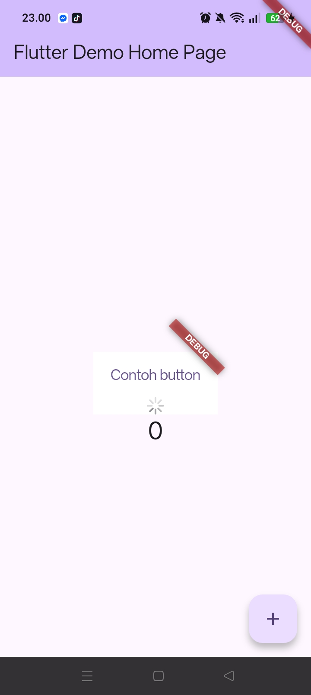

---

### Langkah 2

**Code:**
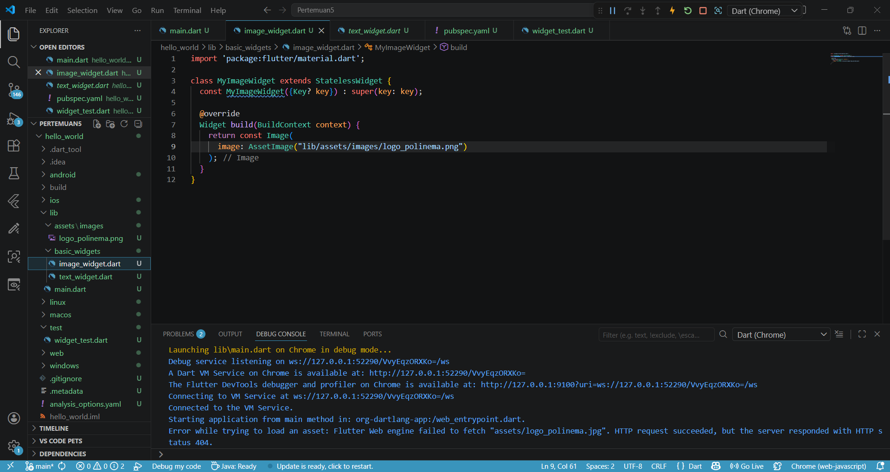

**Output:**
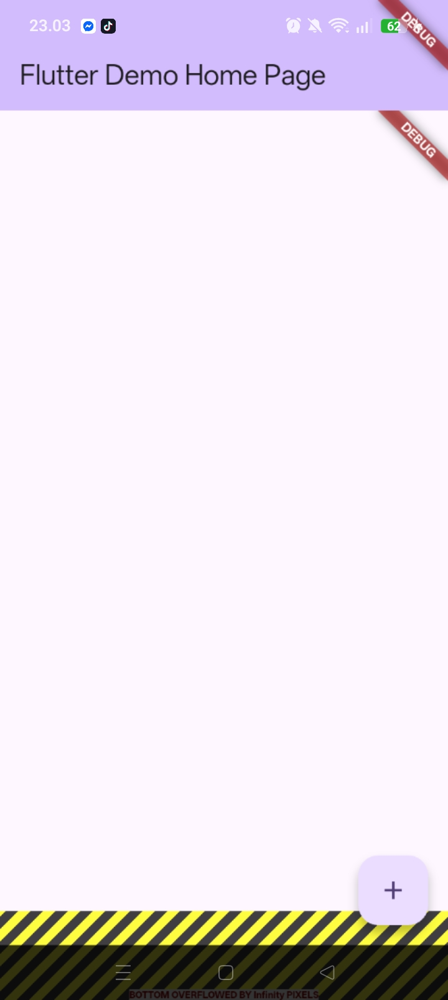

---

### Langkah 3
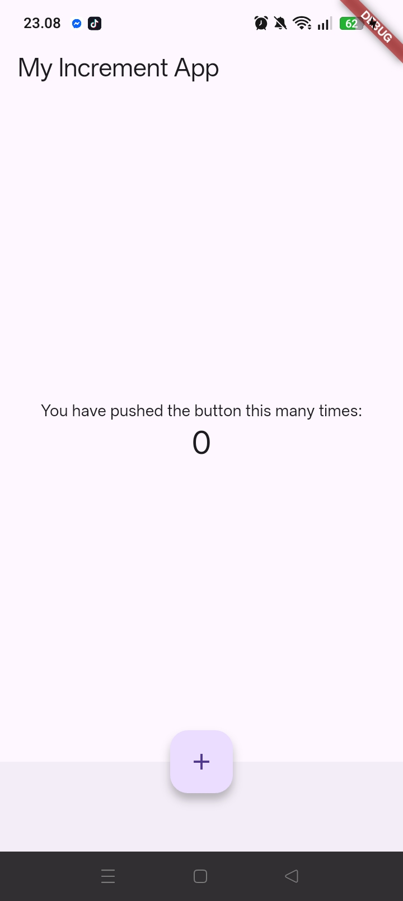

---

### Langkah 4

**Output (True):**

**Output (False):**

---

### Langkah 5

---

### Langkah 6

**Penjelasan:**
Pada tahap ini mempelajari pengaturan layout menggunakan widget seperti Column, Row, serta penggunaan kondisi (if) dalam widget Flutter untuk mengatur tampilan secara dinamis.

---

## 🔹 Praktikum 5 – Widget Material & Cupertino

> Pada praktikum ini, setiap widget dibuat dalam file terpisah di folder `basic_widgets` kemudian di-import ke dalam `main.dart`.

---

### Langkah 1 – Cupertino Button & Loading

**File:** `loading_cupertino.dart`

**Penjelasan:**
Menggunakan widget dari Cupertino (iOS style) seperti `CupertinoButton` dan `CupertinoActivityIndicator`.

---

### Langkah 2 – Floating Action Button

**File:** `fab_widget.dart`

**Penjelasan:**
Menggunakan `FloatingActionButton` sebagai tombol utama dalam aplikasi dengan ikon.

---

### Langkah 3 – Scaffold Widget

**File:** `scaffold_widget.dart`

**Penjelasan:**
Scaffold digunakan sebagai kerangka utama aplikasi yang menyediakan AppBar, body, dan FloatingActionButton.

---

### Langkah 4 – Dialog Widget

**File:** `dialog_widget.dart`

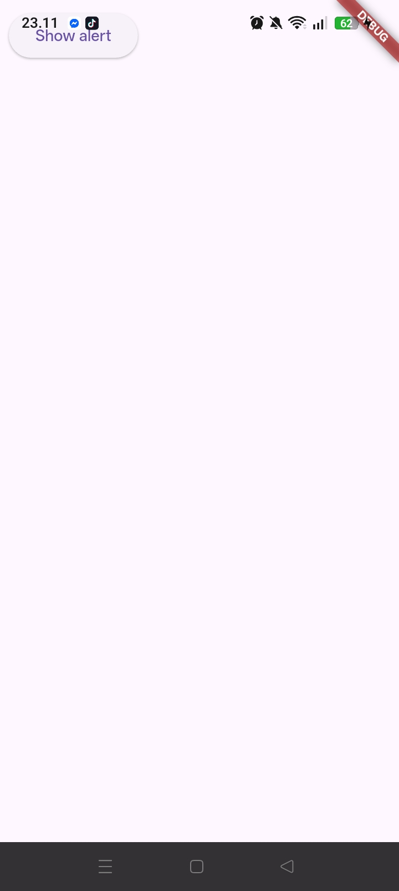

**Penjelasan:**
Menggunakan `AlertDialog` untuk menampilkan pop-up dialog kepada pengguna.

---

### Langkah 5 – Input Widget

**File:** `input_widget.dart`

**Penjelasan:**
Menggunakan `TextField` untuk menerima input dari pengguna.

---

### Langkah 6 – Date Picker

**File:** `date_picker_widget.dart`

**Penjelasan:**
Menggunakan `showDatePicker` untuk memilih tanggal dari kalender.

---

## Tugas Praktikum

### Hasil Implementasi

**Screenshot 1:**
.png)

**Screenshot 2:**
.png)

**Screenshot 3:**
.png)

**Screenshot 4:**
.png)

---

## Kesimpulan

Pada praktikum ini dipelajari:
- Cara menjalankan aplikasi Flutter
- Menghubungkan aplikasi ke perangkat fisik
- Penggunaan widget dasar dan lanjutan
- Layout UI menggunakan Flutter
- Implementasi widget Material dan Cupertino
- Penggunaan input dan interaksi pengguna

---