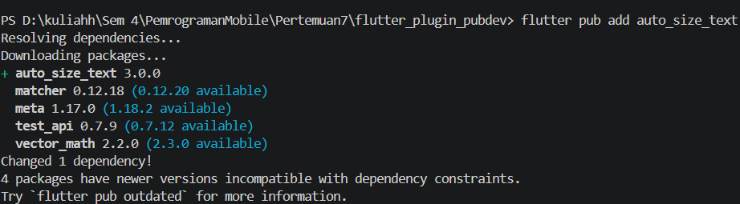
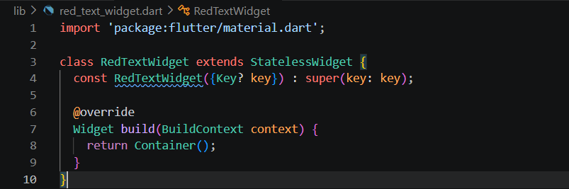
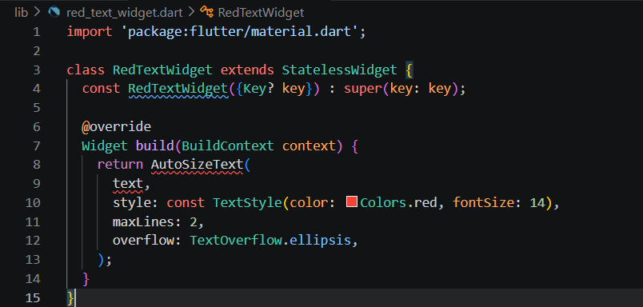
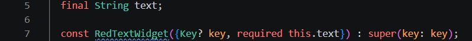
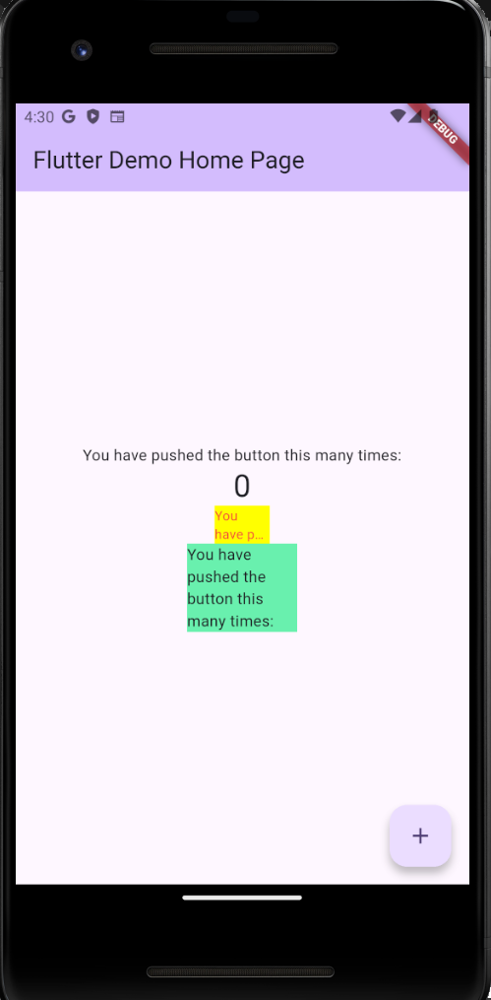

# PRAKTIKUM 07 – MANAJEMEN PLUGIN FLUTTER

Nama  : Nadia Minatul Salma  
NIM   : 244107060141  
Absen : 12  

---

## Judul Praktikum
Manajemen Plugin Flutter menggunakan `auto_size_text`

---

## Link Referensi
https://jti-polinema.github.io/flutter-codelab/07-manajemen-plugin/

---

## Tujuan Praktikum
Praktikum ini bertujuan untuk:
- Memahami cara penggunaan plugin di Flutter
- Menggunakan plugin `auto_size_text`
- Membuat UI teks yang responsif terhadap ukuran layar
- Memahami perbedaan widget Text dan AutoSizeText

---

## Dokumentasi Hasil Praktikum

Berikut hasil screenshot setiap langkah:

- Langkah 1  
  

- Langkah 2  
  

- Langkah 3  
  

- Langkah 4  
  

- Langkah 5  
  

- Langkah 6  
  

- Langkah 6 (2)  
  .png)

---

# PEMBAHASAN TUGAS PRAKTIKUM

---

## 1. Jelaskan maksud dari langkah 2 pada praktikum tersebut!

**Jawaban:**

Langkah 2 adalah **menambahkan dependency plugin `auto_size_text` pada file `pubspec.yaml`**.

```yaml
dependencies:
  auto_size_text: ^3.0.0 
```

Penjelasan:
- Flutter perlu diberi tahu plugin apa yang digunakan
- Tanpa ini, widget AutoSizeText tidak bisa dipakai
- Setelah ditambahkan, harus menjalankan flutter pub get

## 2. Jelaskan maksud dari langkah 5 pada praktikum tersebut!

**Jawaban:**

Pada langkah 5, digunakan widget `AutoSizeText` untuk menampilkan teks yang dapat menyesuaikan ukuran secara otomatis sesuai dengan ruang yang tersedia pada layar.

**Penjelasan:**
- Widget ini membuat teks otomatis menyesuaikan ukuran layar  
- Mencegah overflow (teks keluar dari batas layar)  
- Teks akan mengecil secara otomatis jika ruang tidak cukup  

---

## 3. Pada langkah 6 terdapat dua widget, jelaskan fungsi dan perbedaannya!

### Text
- Menampilkan teks biasa  
- Ukuran font bersifat tetap  
- Tidak menyesuaikan ukuran layar  
- Berpotensi menyebabkan overflow jika teks terlalu panjang  

### AutoSizeText
- Menampilkan teks yang responsif  
- Ukuran font otomatis menyesuaikan ruang yang tersedia  
- Menghindari overflow pada layar kecil  

---

## 4. Jelaskan maksud tiap parameter plugin auto_size_text

Berdasarkan dokumentasi resmi plugin `auto_size_text`, berikut penjelasannya:

### - `text`
Isi teks yang akan ditampilkan pada widget.

### - `style`
Mengatur tampilan teks seperti ukuran font, warna, dan jenis huruf.

### - `maxLines`
Menentukan jumlah maksimal baris teks yang boleh ditampilkan.

### - `minFontSize`
Menentukan ukuran font paling kecil yang diperbolehkan saat penyesuaian ukuran.

### - `maxFontSize`
Menentukan ukuran font paling besar yang diperbolehkan.

### - `overflow`
Mengatur perilaku teks ketika masih tidak muat (misalnya `ellipsis` "...").

###  `stepGranularity`
Menentukan tingkat perubahan ukuran font (semakin kecil nilainya, semakin halus perubahan ukuran).

### - `presetFontSizes`
Menentukan daftar ukuran font yang sudah disediakan dan akan dicoba secara berurutan.

---

## Kesimpulan

Plugin `auto_size_text` sangat berguna dalam pengembangan Flutter karena memungkinkan teks menjadi responsif dan otomatis menyesuaikan ukuran layar, sehingga menghindari overflow dan meningkatkan kualitas tampilan UI.
