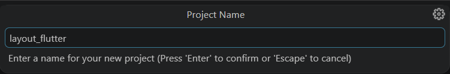
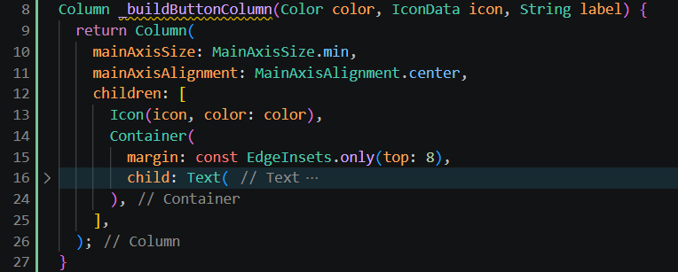
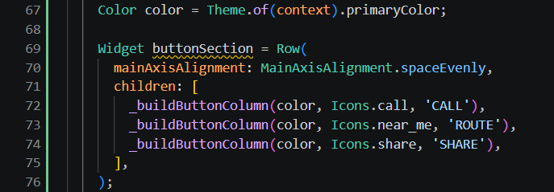
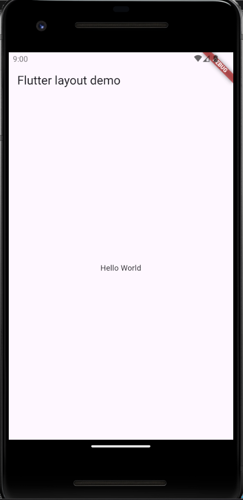

# Praktikum 06 Layout dan Navigasi Flutter

Nama  : Nadia Minatul Salma  
NIM   : 244107060141  
Absen : 12  

---

# Praktikum 1: Layout Dasar

## Langkah 1
### Kode Program
Membuat project Flutter dan menampilkan tampilan awal.

## Output

## Jawaban
Pada langkah ini dibuat aplikasi Flutter sederhana dengan `MaterialApp` dan `Scaffold`.  
Tampilan awal hanya menampilkan teks "Hello World".

---

## Langkah 2: Identifikasi Layout

## Output

## Jawaban
Layout Flutter dibangun dari widget. Semua tampilan seperti teks, gambar, baris, dan kolom merupakan widget. :contentReference[oaicite:0]{index=0}  

Struktur layout terdiri dari:
- Column (vertikal)
- Row (horizontal)
- Container sebagai pembungkus

---

## Langkah 3: Implementasi Title Section

## Output

## Jawaban
Pada bagian ini dibuat:
- Judul tempat wisata
- Lokasi
- Icon bintang dan jumlah rating  

Menggunakan:
- Row
- Column
- Expanded (agar fleksibel)

---

# Praktikum 2: Button Section

## Langkah 1
### Kode Program
Membuat fungsi `_buildButtonColumn()`

## Output

## Jawaban
Function digunakan untuk membuat widget tombol secara reusable.  
Berisi:
- Icon
- Text  
Dengan parameter warna, icon, dan label.

---

## Langkah 2: Membuat Button Section

## Output

## Jawaban
Menggunakan `Row` dengan `MainAxisAlignment.spaceEvenly` agar jarak antar tombol merata.

---

## Langkah 3: Menambahkan ke Body

## Output

## Jawaban
Button section ditambahkan ke body sehingga tampil di aplikasi.

---

# Praktikum 3: Text Section

## Langkah 1
### Kode Program
Menambahkan deskripsi teks

## Output

## Jawaban
Menggunakan `Container` dengan padding dan properti `softWrap` agar teks menyesuaikan layar.

---

## Langkah 2: Tambahkan ke Body

## Output

## Jawaban
Text section ditambahkan sehingga aplikasi memiliki deskripsi lengkap.

---

# Praktikum 4: Image dan ListView

## Langkah 1: Tambah Gambar

## Output

## Jawaban
Gambar dimasukkan melalui folder `assets/images` dan dipanggil menggunakan `Image.asset`.

---

## Langkah 2: Ubah menjadi ListView

## Output

## Jawaban
Menggunakan `ListView` agar tampilan bisa discroll.  
ListView cocok untuk layar kecil karena mendukung scroll dinamis. :contentReference[oaicite:1]{index=1}  

---

# Praktikum 5: Navigasi dan Routing

## Langkah 1: Konsep Navigasi

## Jawaban
Navigasi di Flutter menggunakan:
- Navigator
- Route  

Navigator bekerja seperti stack (push & pop). :contentReference[oaicite:2]{index=2}  

---

## Langkah 2: Membuat Halaman

## Output

## Jawaban
Membuat:
- HomePage
- ItemPage  

Untuk multi halaman aplikasi.

---

## Langkah 3: Routing

## Jawaban
Menggunakan:
- initialRoute
- routes  

Untuk berpindah halaman.

---

## Langkah 4: ListView dan Data

## Output

## Jawaban
Data ditampilkan dalam bentuk ListView menggunakan model `Item`.

---

## Langkah 5: Navigasi dengan Data

## Output

## Jawaban
Data dikirim menggunakan:
Navigator.pushNamed(context, '/item', arguments: item);
Dan diterima dengan:
ModalRoute.of(context)!.settings.arguments

---

# KESIMPULAN

Pada praktikum ini dipelajari:

- Konsep layout Flutter menggunakan widget  
- Penyusunan UI dengan Row, Column, Container  
- Penggunaan ListView untuk scroll  
- Penggunaan asset gambar  
- Navigasi antar halaman menggunakan Navigator  
- Routing dan pengiriman data antar halaman  

Flutter menggunakan konsep widget tree, dimana semua elemen UI adalah widget. :contentReference[oaicite:3]{index=3}  

---

# HASIL AKHIR

Aplikasi yang dibuat memiliki fitur:
- Layout UI lengkap (gambar, teks, tombol)
- Scroll menggunakan ListView
- Navigasi antar halaman
- Pengiriman data antar halaman
